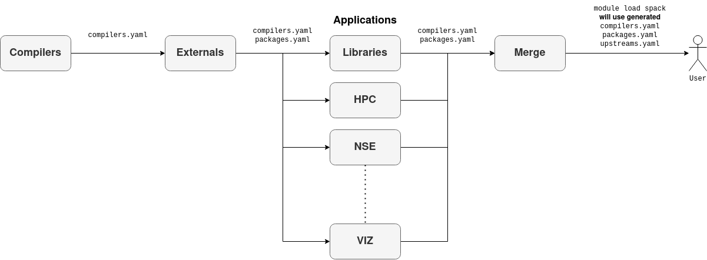

# Conceptual Deployment of Software Stacks with Spack

This document outlines the concepts involved in deploying the BlueBrain
software stack on project-internal clusters using GitLab Pipelines.

For historic documentation of the Jenkins deployment, view an earlier
revision of this file.

## Deployment Workflow

The deployment is based on successive software builds in stages,
using [Spack environments](https://spack.readthedocs.io/en/latest/environments.html).
Each stage propagates an augmented version of the configuration.
The following diagram presents a simplified view:

There are several stages, with Spack environments defined in
[`bluebrain/deployment/environments`](../deployment/environments):

1. **Compilers**: necessary baseline compilers, such as the GCC and Intel
   compiler suites.
   This stage will import a basic configuration from
   [`bluebrain/sysconfig/bluebrain5`](../sysconfig/bluebrain5)
   and generate a new baseline `compilers.yaml` configuration file.
   The entire configuration is passed through to all following stages via
   GitLab artifacts.
2. **Externals**: additional compilers, software and tools that are needed
   to build the software stack.
   Most packages built here are exported to an augmented version of
   `packages.yaml`, and passed on.
   Additional compilers are also added to `compilers.yaml`.
3. **Applications**: will build several environments for different teams.
   Each environment may have individual preferences relating to how
   packages are built, i.e., settings for HDF5/MPI.
   Note that some preferences, e.g., version requirements for `numpy` and
   other Python packages should be added to the global
   [`bluebrain/sysconfig/bluebrain5/packages.yaml`](../sysconfig/bluebrain5/packages.yaml).
   The `libraries` environment of this stage is used for packages that are
   shared across several teams.

In a subsequent GitLab job, `update_config`, the modules and configuration
of previous stages will be aggregated and prepared for consumption by
users.
This includes a generated `upstreams.yaml` that will instruct Spack to
depend on centrally deployed software when building packages for users.
The final configuration files end up in a directory including the
deployment date:

    /gpfs/bbp.cscs.ch/ssd/apps/bsd/2022-01-10/config

and, if the pipeline is not running for a pull request, linked to

    /gpfs/bbp.cscs.ch/ssd/apps/bsd/config

A shell script `modules.sh` in both directories may be used to configure
access to the deployed modules.
The `spack` module can be used to access the Spack used to build the last
deployment pipeline.
It will set the following environment variables:

* `SPACK_SYSTEM_CONFIG_PATH` to point to `/gpfs/bbp.cscs.ch/ssd/apps/bsd/config`
* `SPACK_USER_CACHE_PATH` to point to `$HOME/spack_install`

For pull requests build, both locations will be adjusted to provide an
independent setup.
When using a cloned Spack from this repository, both variables should be
set to fully utilize centrally deployed software.

## GitLab Pipeline Structure

### Top-level Pipeline

The usual [`.gitlab-ci.yml`](../../.gitlab-ci.yml) is used to provide basic
configuration using, amongst others, the following variables:

* `DEFAULT_GCC_VERSION` for the default compiler to be used throughout the
  deployment
* `LEGACY_GCC_VERSION` in case a compiler relies on an older GCC
* `DEPLOYMENT_DATE` for the directory to deploy in.
  Every deployment iteration should update Spack, compiler and package
  versions, and set this directory to a new one.

The first job in this pipeline will setup a dotenv file and populate it
with variables, taking the above into account.
Directories will be adjusted if a build for a Github pull request is
detected.

A following bridge job will trigger a child pipeline to build the software
in an atomic fashion — GitLab does not utilize a FIFO scheduling avoiding
concurrent pipelines, but rather provides a "resource" mechanism to ensure
that only one job at a time can "occupy" a "resource".
We use this together with a parent-child pipeline construct to ensure that
only one pipeline is allowed to build software, and to avoid that different
jobs of different pipelines are building in an interleaved fashion.

Finally, a "summary" job will grab the artifacts of the child pipeline,
stored in GPFS (barring any other communication mechanism), and provide
test results for the parent pipeline.

Pull requests will mirror the central deployment, but will be build in a
directory

    /gpfs/bbp.cscs.ch/ssd/apps/bsd/pulls/$GITHUB_PULL_REQUEST_ID

### Build Pipeline

This pipeline is defined in
[`bluebrain/deployment/gitlab-ci.yml`](../deployment/gitlab-ci.yml).
It will follow the software building procedure described above,
running additional jobs to

* verify the Python package integrity using `pip check`
* verify the module integrity by running the tests of the [module testing
  project](https://bbpgitlab.epfl.ch/hpc/module-testing) in an additional
  parent-child pipeline project
* provide some feedback on pull request testing to the user on Github

Test result and concretization output from the different stages can also be
accessed under

    /gpfs/bbp.cscs.ch/ssd/apps/bsd/2022-01-10/artifacts

or similar for pull requests.

## Configuration Files and Helper Scripts

All configuration files for deployments and user workstations, laptops can
be found in the [`bluebrain/sysconfig`](../sysconfig) directory.

The pipeline in
[`bluebrain/deployment/gitlab-ci.yml`](../deployment/gitlab-ci.yml)
will augment the system configuration, partially using scripts defined in
[`bluebrain/deployment/bin`](../deployment/bin).
Please refer to the pipeline definition and the scripts for details.
